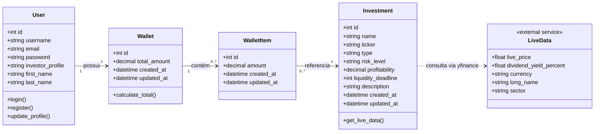
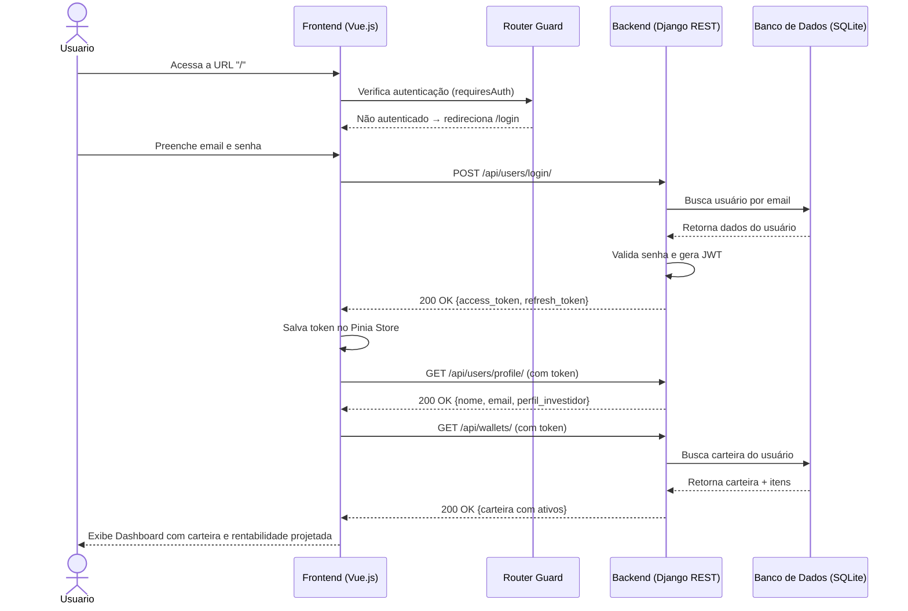
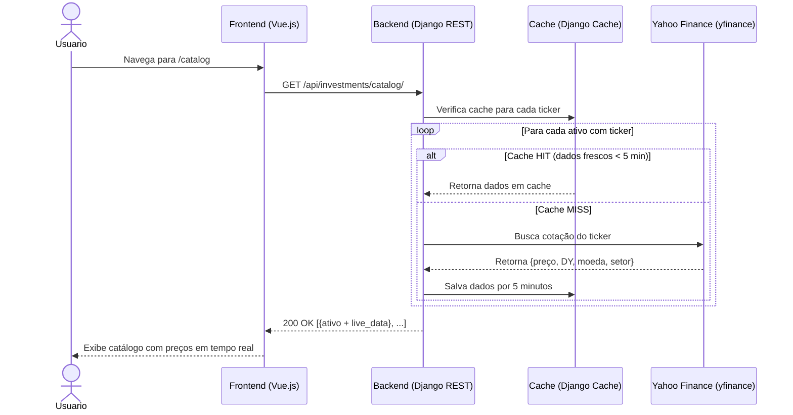
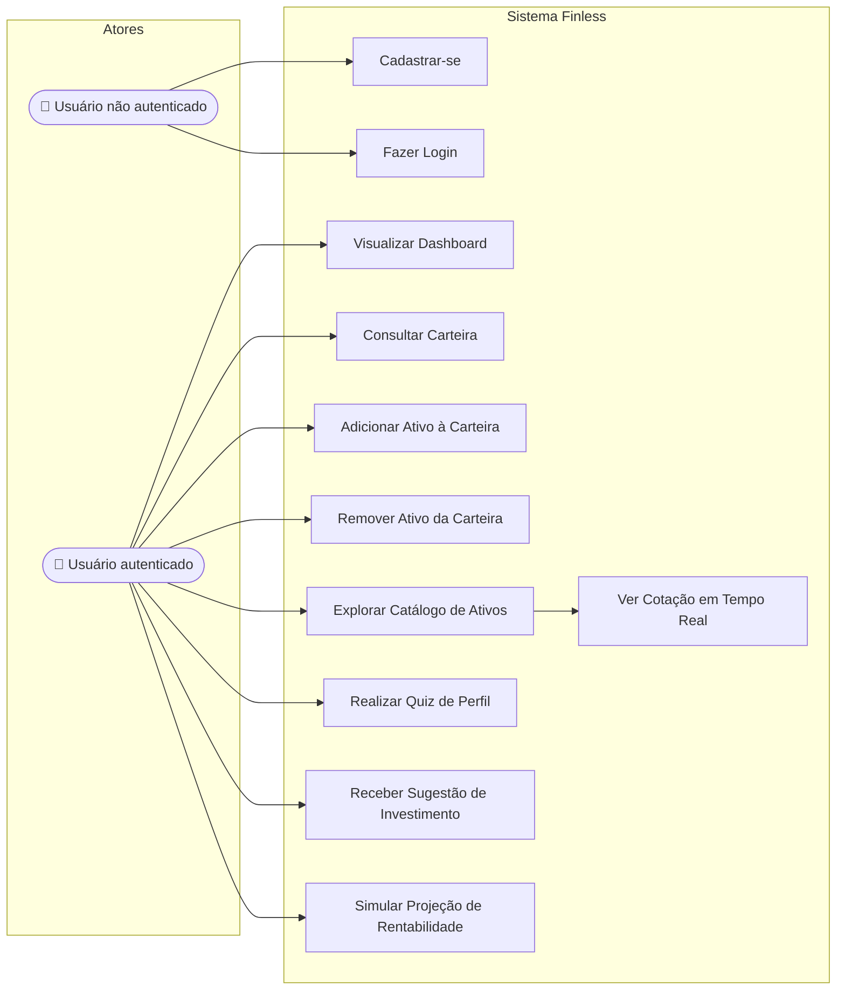

# 🚀 FinLess - Calculadora de Investimentos Premium

> Trabalho Prático da disciplina de Engenharia de Software  
> **Professor:** Marco Tulio Valente

### 👥 Integrantes 

- **Cauã Neto Santos Pires** (Backend)
- **Mateus Matsura Teles Costa** (Fullstack)
- **Pedro Rangel Ferreira de Aguiar** (Backend)
- **Renato Vilela de Melo Pacheco Pinto** (Frontend)

---
## 🎯 Tópico Central: Calculadora de Aplicações Financeiras

### Objetivo do Sistema
**Calculadora para organização e planejamento de investimentos financeiros.**
O sistema tem como objetivo auxiliar pessoas na **organização e no planejamento de seus investimentos financeiros**.  A partir do montante disponível, dos ativos escolhidos e do perfil de investidor, a aplicação sugere uma **divisão adequada dos recursos**.  A calculadora busca facilitar a tomada de decisões, tornando o processo de **investimento mais simples e acessível**, sugerindo além da divisão do montante, a quantidade a ser investida por ativo. Cada usuário terá uma **carteira individual e protegida**, garantindo privacidade e segurança sobre suas informações financeiras.  Futuramente, o sistema poderá incluir recursos como definição de metas, controle de gastos e planejamento para alcançar um patrimônio desejado.

### 🛠️ Tecnologias e Arquitetura 
- **Frontend:** Vue.js (Vite)
- **Backend:** Django REST Framework
- **Database:** SQLite

#### Agentes de IA:
- Google Antigravity.
- *OBS:* ChatBots como Google Gemini, ChatGPT e Claude em casos de limitação dos agentes.

---
## 📖 Histórias de Usuário

- [x] Como usuário, gostaria de poder me cadastrar e salvar meus dados entre sessões.
- [x] Como usuário, gostaria de poder visualizar e/ou alterar meus dados e carteira de investimento.
- [x] Como usuário, gostaria de acessar meus dados e resultados por meio de gráficos informativos.
- [x] Como usuário, gostaria de receber sugestões dos tipos de investimentos.
- [x] Como usuário, gostaria de consultar as características de um investimento para avaliar seus riscos, rentabilidade e prazo.
- [x] Como usuário, gostaria de projetar meus ganhos em um intervalo de tempo.
- [x] Como usuário, gostaria de descobrir meu perfil de investimento.
- [x] Como usuário, gostaria de indicar um montante para sugestão.

---
## ⚙️ Guia de Execução e Testes Locais

Para que o ecossistema (Frontend, Backend e Banco de Dados) funcione corretamente, siga as instruções abaixo:

### 1. Configurando o Backend (Terminal 1)
O sistema foi projetado para rodar com **SQLite** localmente para facilitar a execução e testes.
O backend utiliza Python e Django. Na raiz do projeto:

**1.1. Criar e Ativar o Ambiente Virtual:**
```bash
python3 -m venv .venv
source .venv/bin/activate  # No Windows (PowerShell): .\.venv\Scripts\Activate.ps1
```
*Legenda:* Isola as bibliotecas do projeto do resto da sua máquina.

**1.2. Instalar as Dependências:**
```bash
cd backend
../.venv/bin/pip install -r requirements.txt
```
*Legenda:* Instala o Django, DRF, yfinance e outras bibliotecas necessárias.

**1.3. Migração do Banco de Dados e Povoamento:**
```bash
../.venv/bin/python manage.py migrate
../.venv/bin/python manage.py seed_investments
```
*Legenda:* O `migrate` cria as tabelas oficiais no arquivo `db.sqlite3`. O `seed_investments` injeta ativos reais da bolsa B3 (ações, FIIs e tesouro) no banco de dados.

**1.4. Iniciar o Servidor Django:**
```bash
../.venv/bin/python manage.py runserver
```
*Legenda:* Inicia a API REST localmente em `http://localhost:8000/`.

### 2. Configurando o Frontend (Terminal 2)
O frontend utiliza Node.js e Vue 3. Abra um **novo terminal** na raiz do projeto:

**2.1. Instalar as Bibliotecas Node:**
```bash
cd frontend
npm install
```
*Legenda:* Baixa dependências como Vue, Vite, Pinia (Estado) e Chart.js (Gráficos).

**2.2. Iniciar o Servidor de Desenvolvimento:**
```bash
npm run dev
```
*Legenda:* Inicia a interface na porta `http://localhost:5173/`.

### 3. Replicabilidade do Teste do Sistema
1. Acesse **`http://localhost:5173/`**. O **Router Guard** irá barrar o acesso ao Dashboard e forçar o redirecionamento para o Login.
2. Clique em **"Crie uma conta"**. Teste o formulário (erros de senha, emails inválidos).
3. Após o login, o **Dashboard** buscará sua carteira.
4. Navegue até a aba de **Carteira**, adicione ativos (como ITUB4 ou Tesouro) e observe o saldo total calculando automaticamente.
5. Volte ao Dashboard e veja a **Rentabilidade Projetada** sendo calculada de forma dinâmica através da média ponderada dos ativos que você escolheu!

---

## 📐 Documentação UML do Sistema

> Os diagramas abaixo fornecem uma visão técnica da arquitetura e dos fluxos do sistema, gerados com **Mermaid** e renderizáveis diretamente no GitHub.

---

### 1. Diagrama de Classes

Representa a estrutura dos modelos de dados do backend e seus relacionamentos.



---

### 2. Diagrama de Sequência — Autenticação e Acesso ao Dashboard

Ilustra o fluxo completo desde o login do usuário até o carregamento do dashboard com os dados da carteira.



---

### 3. Diagrama de Sequência — Consulta ao Catálogo de Ativos em Tempo Real

Ilustra como o sistema busca cotações ao vivo do Yahoo Finance com cache para otimização.



---

### 4. Diagrama de Casos de Uso

Apresenta os atores do sistema e as funcionalidades disponíveis a cada um.


